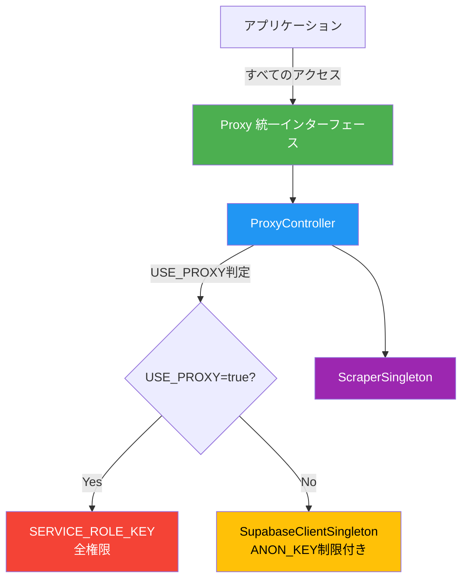

# シングルトン+プロキシパターン - Supabase/スクレイパー管理システム

このモジュールは、アプリケーション全体でSupabaseクライアントとスクレイパーを効率的に管理するためのシングルトン+プロキシパターンを実装しています。

## 📋 目次

- [概要](#概要)
- [アーキテクチャ](#アーキテクチャ)
- [クラス構成](#クラス構成)
- [使用方法](#使用方法)
- [環境変数](#環境変数)
- [セキュリティ](#セキュリティ)
- [よくある質問](#よくある質問)

## 概要

### 主な機能

1. **シングルトンパターン**: アプリ起動時に一度だけインスタンスを生成し、リソースを効率的に利用
2. **プロキシパターン**: USE_PROXY環境変数による動的な権限制御
3. **統一インターフェース**: 全アクセスをProxyクラス経由に限定し、一貫性を保証
4. **セキュリティ**: SERVICE_ROLE_KEYの厳重管理と外部露出防止

### 利点

- ✅ **パフォーマンス向上**: インスタンスの再利用によるオーバーヘッド削減
- ✅ **メモリ効率化**: 不要なインスタンス生成を防止
- ✅ **一貫性**: すべてのアクセスが統一されたインターフェースを経由
- ✅ **柔軟性**: 環境変数による動的な動作切り替え
- ✅ **セキュリティ**: 権限管理の一元化と厳格な制御

## アーキテクチャ



### 処理フロー

1. アプリケーションが`Proxy.getSupabase()`を呼び出す
2. ProxyControllerが`USE_PROXY`環境変数を確認
3. `USE_PROXY=true`の場合、SERVICE_ROLE_KEYクライアントを返却
4. `USE_PROXY=false`の場合、匿名キークライアントを返却
5. すべての処理が統一されたインターフェースで実行される

## クラス構成

### 1. SupabaseClientSingleton

**役割**: 匿名キー（ANON_KEY）を使用したクライアントサイドSupabaseクライアント

**特徴**:
- Row Level Security (RLS) ポリシーによって制限される
- ブラウザに公開されても安全
- クライアントサイドからのアクセスに使用

**コード例**:
```typescript
// 内部実装（直接使用しない）
const singleton = SupabaseClientSingleton.getInstance()
const client = singleton.getClient()
```

### 2. ScraperSingleton

**役割**: BaseScraperのシングルトン管理

**特徴**:
- ブラウザインスタンスの再利用
- プロキシ設定の一元管理
- リソースの効率的な利用

**コード例**:
```typescript
// 内部実装（直接使用しない）
const singleton = ScraperSingleton.getInstance()
const scraper = singleton.getScraper()
```

### 3. ProxyController

**役割**: USE_PROXY環境変数による振り分け制御

**特徴**:
- 環境変数による動的な動作切り替え
- SERVICE_ROLE_KEYの安全な管理
- 統一されたアクセスポイント

**コード例**:
```typescript
// 内部実装（直接使用しない）
const controller = new ProxyController()
const client = controller.getSupabaseClient()
```

### 4. Proxy（統一インターフェース）

**役割**: すべてのアクセスを統一するメインインターフェース

**特徴**:
- 唯一の公開クラス
- シンプルで一貫性のあるAPI
- 環境に応じた自動切り替え

**コード例**:
```typescript
// 推奨: すべてのアクセスはProxyクラス経由
import { Proxy } from "@/lib/singletons"

// Supabaseクライアントの取得
const supabase = Proxy.getSupabase()

// スクレイパーの取得
const scraper = Proxy.getScraper()

// プロキシ有効判定
const isProxy = Proxy.isProxyEnabled()
```

## 使用方法

### 基本的な使い方

#### 1. Supabaseクライアントの使用

```typescript
import { Proxy } from "@/lib/singletons"

// データの取得
async function getProducts() {
  const supabase = Proxy.getSupabase()

  const { data, error } = await supabase
    .from("products")
    .select("*")
    .eq("shop_type", "official")

  if (error) {
    console.error("エラー:", error)
    return []
  }

  return data
}

// データの挿入
async function createProduct(product: ProductInsert) {
  const supabase = Proxy.getSupabase()

  const { data, error } = await supabase
    .from("products")
    .insert(product)
    .select()
    .single()

  if (error) {
    throw new Error(`商品の作成に失敗しました: ${error.message}`)
  }

  return data
}
```

#### 2. スクレイパーの使用

```typescript
import { Proxy } from "@/lib/singletons"

async function scrapeWebsite() {
  const scraper = Proxy.getScraper()

  try {
    // ブラウザの起動
    await scraper.launch()

    // スクレイピング実行
    const result = await scraper.scrape(
      "https://example.com",
      async (page) => {
        // ページから情報を抽出
        return await page.evaluate(() => {
          return {
            title: document.title,
            products: []
          }
        })
      }
    )

    if (result.success) {
      console.log("スクレイピング成功:", result.data)
    } else {
      console.error("スクレイピング失敗:", result.error)
    }
  } finally {
    // ブラウザを閉じる
    await scraper.close()
  }
}
```

#### 3. 環境に応じた処理分岐

```typescript
import { Proxy } from "@/lib/singletons"

async function processData() {
  if (Proxy.isProxyEnabled()) {
    console.log("🔐 プロキシモード（SERVICE_ROLE_KEY使用）")
    console.log("⚠️ サーバーサイドでのみ実行してください")
    // 全権限での処理
  } else {
    console.log("🔓 通常モード（ANON_KEY使用）")
    console.log("✅ クライアントサイドでも安全に実行可能")
    // RLS制限付き処理
  }

  const supabase = Proxy.getSupabase()
  // 環境に応じて適切なクライアントが自動で選択される
}
```

### API Routes での使用

```typescript
// src/app/api/products/route.ts
import { NextResponse } from "next/server"
import { Proxy } from "@/lib/singletons"

export async function GET() {
  const supabase = Proxy.getSupabase()

  const { data, error } = await supabase
    .from("products")
    .select("*")

  if (error) {
    return NextResponse.json(
      { error: error.message },
      { status: 500 }
    )
  }

  return NextResponse.json({ data })
}
```

### Server Components での使用

```typescript
// src/app/products/page.tsx
import { Proxy } from "@/lib/singletons"

export default async function ProductsPage() {
  const supabase = Proxy.getSupabase()

  const { data: products } = await supabase
    .from("products")
    .select("*")

  return (
    <div>
      <h1>商品一覧</h1>
      {products?.map((product) => (
        <div key={product.id}>{product.name}</div>
      ))}
    </div>
  )
}
```

## 環境変数

### 必須環境変数

```bash
# Supabase接続情報（必須）
NEXT_PUBLIC_SUPABASE_URL=https://your-project.supabase.co
NEXT_PUBLIC_SUPABASE_ANON_KEY=your-anon-key

# プロキシモード制御
USE_PROXY=false  # "true" または "false"

# SERVICE_ROLE_KEY（USE_PROXY=trueの場合のみ必須）
SUPABASE_SERVICE_ROLE_KEY=your-service-role-key
```

### 環境変数の説明

| 変数名 | 説明 | 必須 | 公開範囲 |
|--------|------|------|----------|
| `NEXT_PUBLIC_SUPABASE_URL` | SupabaseプロジェクトURL | ✅ | クライアント |
| `NEXT_PUBLIC_SUPABASE_ANON_KEY` | 匿名キー（RLS制限） | ✅ | クライアント |
| `USE_PROXY` | プロキシモード有効化 | ❌ | サーバー |
| `SUPABASE_SERVICE_ROLE_KEY` | サービスロールキー（全権限） | ⚠️ | サーバー |

⚠️ **重要**: `SUPABASE_SERVICE_ROLE_KEY`は絶対にクライアントサイドに露出させないでください。

## セキュリティ

### SERVICE_ROLE_KEYの取り扱い

#### ✅ 推奨される使用方法

1. **サーバーサイドのみで使用**
   ```typescript
   // ✅ OK: API Routes (サーバーサイド)
   // src/app/api/admin/route.ts
   export async function POST() {
     const supabase = Proxy.getSupabase()
     // SERVICE_ROLE_KEYが使用される（USE_PROXY=trueの場合）
   }
   ```

2. **環境変数の厳重管理**
   ```bash
   # ✅ OK: .env.local（gitignore済み）
   SUPABASE_SERVICE_ROLE_KEY=your-key
   ```

3. **適切な権限チェック**
   ```typescript
   // ✅ OK: 認証状態を確認
   export async function POST(request: Request) {
     const session = await getServerSession()
     if (!session || !session.user.isAdmin) {
       return new Response("Unauthorized", { status: 401 })
     }

     const supabase = Proxy.getSupabase()
     // 管理者のみアクセス可能
   }
   ```

#### ❌ 避けるべき使用方法

1. **クライアントコンポーネントでの使用**
   ```typescript
   // ❌ NG: クライアントコンポーネント
   "use client"

   export default function ClientPage() {
     const supabase = Proxy.getSupabase()
     // USE_PROXY=trueの場合、SERVICE_ROLE_KEYが露出する危険性
   }
   ```

2. **公開リポジトリへのコミット**
   ```bash
   # ❌ NG: .envファイルをコミット
   git add .env
   git commit -m "Add env"  # 絶対にやらないこと
   ```

3. **ブラウザへの送信**
   ```typescript
   // ❌ NG: クライアントに送信
   return NextResponse.json({
     serviceRoleKey: process.env.SUPABASE_SERVICE_ROLE_KEY
   })
   ```

### セキュリティチェックリスト

- [ ] `SUPABASE_SERVICE_ROLE_KEY`が`.env.local`に保存されている
- [ ] `.env.local`が`.gitignore`に含まれている
- [ ] `USE_PROXY=true`の場合、サーバーサイドでのみ使用している
- [ ] クライアントコンポーネントでは`USE_PROXY=false`を使用
- [ ] API Routesで適切な認証チェックを実施
- [ ] Supabase RLSポリシーが正しく設定されている

## よくある質問

### Q1: 既存のsupabase.tsやsupabase-server.tsとの違いは?

**A**: 既存のファイルは単純なクライアント生成関数ですが、新しいシングルトン+プロキシシステムは以下の利点があります:

- シングルトンによるインスタンス管理
- USE_PROXYによる動的な権限切り替え
- 統一されたインターフェース
- より強固なセキュリティ管理

### Q2: USE_PROXY=trueにする必要があるのはどんな時?

**A**: 以下の場合に`USE_PROXY=true`を設定します:

- RLSポリシーをバイパスする必要がある場合
- 管理者権限での一括処理が必要な場合
- スクレイピング結果の直接保存など、高権限操作が必要な場合

**重要**: 必ずサーバーサイド（API Routes等）でのみ使用してください。

### Q3: クライアントサイドで使用しても安全?

**A**: はい、`USE_PROXY=false`の場合は安全です:

- 匿名キー（ANON_KEY）のみを使用
- RLSポリシーによって保護される
- ブラウザに公開されても問題なし

`USE_PROXY=true`の場合は、必ずサーバーサイドでのみ使用してください。

### Q4: スクレイパーのブラウザインスタンスはいつ閉じるべき?

**A**: スクレイパーはシングルトンで管理されるため、以下のタイミングで閉じます:

```typescript
// スクレイピング処理終了後
await scraper.close()

// アプリケーション終了時（自動的に閉じられる場合もある）
```

通常は`finally`ブロックで確実に閉じることを推奨します。

### Q5: テスト環境でのリセット方法は?

**A**: 各シングルトンにはリセットメソッドが用意されています:

```typescript
// テスト後のクリーンアップ
SupabaseClientSingleton.resetInstance()
await ScraperSingleton.resetInstance()
Proxy.resetController()
```

**注意**: 本番環境では使用しないでください。

### Q6: 既存のコードを移行する必要はある?

**A**: 段階的な移行を推奨します:

```typescript
// 旧: 既存のコード
import { supabase } from "@/lib/supabase"
const { data } = await supabase.from("products").select()

// 新: Proxyクラスを使用
import { Proxy } from "@/lib/singletons"
const supabase = Proxy.getSupabase()
const { data } = await supabase.from("products").select()
```

既存コードもそのまま動作しますが、新しいコードではProxyクラスの使用を推奨します。

## まとめ

シングルトン+プロキシパターンを使用することで、以下のメリットが得られます:

✅ **効率性**: リソースの再利用によるパフォーマンス向上
✅ **柔軟性**: 環境変数による動的な動作切り替え
✅ **一貫性**: 統一されたインターフェース
✅ **セキュリティ**: 権限管理の一元化
✅ **保守性**: コードの可読性と管理性の向上

**重要な注意事項**:
- すべてのアクセスは`Proxy`クラス経由で行う
- `USE_PROXY=true`の場合は必ずサーバーサイドでのみ使用
- `SERVICE_ROLE_KEY`は絶対に外部に露出させない

---

**問題が発生した場合**: プロジェクトのIssueを作成してください。
